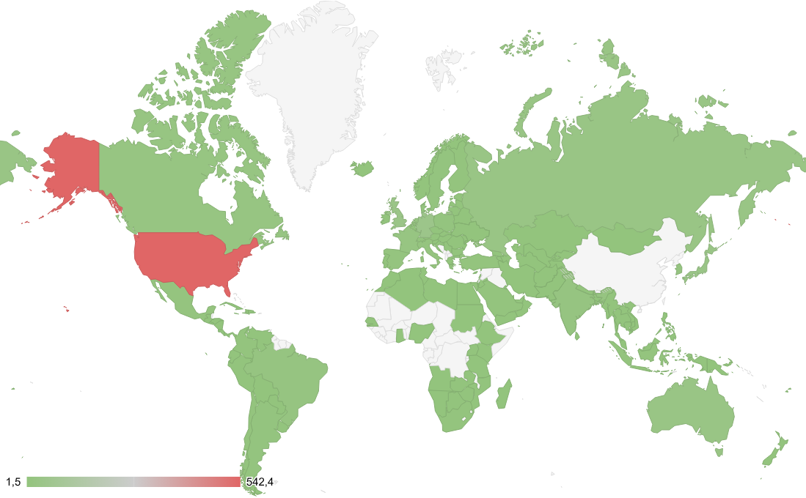

# Расчётно-пояснительная записка

**Дисциплина:** Проектирование высоконагруженных систем  
**Тема проекта:** Проектирование бэкенда высоконагруженного сервиса агрегации новостей и обсуждений (на примере «Reddit»)

---

## Оглавление

1. [Тема и целевая аудитория](#1-тема-и-целевая-аудитория)
2. [Расчет нагрузки](#2-расчет-нагрузки)
3. [Глобальная балансировка нагрузки](#3-глобальная-балансировка-нагрузки)
4. [Список источников](#список-источников)
   
---

## 1. Тема и целевая аудитория

### 1.1 Тип сервиса, рыночная ниша и аналоги
**Выбранная тема:** проектирование бэкенда сервиса агрегации пользовательского контента, модерации и дискуссий.  
**Реальные аналоги:** Reddit, Pikabu, Hacker News.  
Рынок сформирован. Основная ценность формируется за счет сетевого эффекта и пользовательского контента (UGC).

### 1.2 Целевая аудитория: размер и локализация
Массовый конечный пользователь (B2C). Опираемся на **официальные данные Reddit Inc. на 30 июня 2026 года**:

| Метрика | Значение | Локализация / Период | Источник |
| :--- | :--- | :--- | :--- |
| **DAU (Daily Active Uniques)** | **130 000 000+** уникальных пользователей | Глобально, Q2 2026 | [Reddit Investor Relations](https://investor.redditinc.com) |
| **WAU (Weekly Active Uniques)** | **514 000 000+** уникальных пользователей | Глобально, Q2 2026 | [Reddit Investor Relations](https://investor.redditinc.com) |
| **Active Communities** | **100 000+** активных сообществ | Глобально, Q2 2026 | [Reddit Investor Relations](https://investor.redditinc.com) |
| **Posts & Comments** | **26 000 000 000+** публикаций и комментариев | Накоплено за всё время | [Reddit Investor Relations](https://investor.redditinc.com) |
| **MAU (оценка)** | **~1 300 000 000** уникальных посетителей | Глобально, 2026 | [Wiki Iphoster: Reddit обзор 2026](https://wiki.iphoster.net/wiki/Reddit_-_%D0%BE%D0%B1%D0%B7%D0%BE%D1%80_-_2026#.D0.A1.D1.82.D0.B0.D1.82.D0.B8.D1.81.D1.82.D0.B8.D0.BA.D0.B0_.282026.29) |

### 1.3 Продуктовые требования

Сервис должен:

1. Предоставлять пользователям единую ленту актуального пользовательского контента по интересующим их темам;
2. Обеспечивать разделение контента по тематическим сообществам и возможность подписки на них;
3. Позволять пользователям создавать публикации и участвовать в обсуждениях;
4. Обеспечивать коллективную оценку публикаций и комментариев;
5. Формировать персонализированную ленту на основе подписок, рейтинга и времени публикации;
6. Предоставлять быстрый поиск по публикациям и тематическим сообществам;
7. Поддерживать безопасную регистрацию и авторизацию пользователей.

### 1.4 Функционал MVP

Для проектирования выделены следующие 7 ключевых функций, покрывающих основной сценарий использования сервиса:

1. **Регистрация и авторизация пользователей.** Создание аккаунта и безопасный вход в систему;
2. **Создание и управление сообществами (сабреддитами).** Пользователи могут создавать новые тематические сообщества, настраивать их описание, правила и подписываться на них;
3. **Создание и публикация постов.** Пользователь создаёт текстовый пост, ссылку или медиафайл внутри конкретного сообщества;
4. **Голосование за контент (Upvote/Downvote).** Пользователи оценивают посты и комментарии стрелками вверх/вниз, формируя рейтинг и сортировку ленты;
5. **Комментирование с древовидной структурой.** Пользователи оставляют комментарии к постам и отвечают на другие комментарии с вложенностью до 10 уровней;
6. **Формирование персональной ленты.** Агрегация постов из подписанных сообществ с сортировкой по популярности (Hot) или времени публикации (New);
7. **Поиск по постам и сообществам.** Полнотекстовый поиск по заголовкам, тексту постов и названиям сабреддитов;

## 2. Расчет нагрузки

### 2.1 Аудиторные метрики

Базовые показатели аудитории опираются на официальную отчетность платформы.

| Метрика | Значение | Обоснование и источник |
|---|---|---|
| Месячная аудитория (MAU) | 1 300 000 000 | Оценочные данные по уникальным посетителям глобально [Источник 2]. |
| Дневная аудитория (DAU) | 130 000 000 | Официальный отчет Reddit Investor Relations (Q2 2026) [Источник 1]. |

### 2.2 Средний размер "хранилища" пользователя (в штуках и ГБ/МБ)

**Логика расчета:**

Контент пользователя — это его публикации (UGC). Чтобы посчитать размер хранилища одного пользователя, мы берем ежедневную генерацию контента платформы, делим на актуальный DAU (130 млн) и умножаем на 365 дней, получая средний годовой объем данных на одного человека.

- **Исходные данные:** В среднем в день создается 1,2 млн постов и 9,7 млн комментариев [Источник 4].
- **Пропорция постов** [Источник 3]: 38% — изображения, 29% — текст, 21% — видео, 12% — ссылки.
- **Генерация на 1 DAU в день:**
    - Комментарии: `9 700 000 / 130 000 000 = 0,0746` шт. в день.
    - Посты (все): `1 200 000 / 130 000 000 = 0,0092` шт. в день.

Применяем пропорции к постам и умножаем на 365 дней:

| Тип данных (на 1 пользователя за год) | Количество, шт. | Объем, МБ | Обоснование / Расчет |
|---|---|---|---|
| Комментарии | ~ 27,2 шт. | ~ 0,05 МБ | 0,0746 комментов/день × 365. Вес одного текста с метаданными принимаем за ~2 КБ. |
| Текстовые посты | ~ 1,0 шт. | ~ 0,002 МБ | 0,0092 постов × 29% × 365. Вес принимаем за ~2 КБ. |
| Посты со ссылками | ~ 0,4 шт. | ~ 0,001 МБ | 0,0092 постов × 12% × 365. Вес ссылки с метаданными ~2 КБ. |
| Изображения | ~ 1,3 шт. | ~ 6,5 МБ | 0,0092 постов × 38% × 365. В [Источнике 3] указано ограничение 20 МБ, но оптимальный вес до 10 МБ. Для расчета берем среднее значение 5 МБ на фото. |
| Видео | ~ 0,7 шт. | ~ 14,0 МБ | 0,0092 постов × 21% × 365. Опираясь на вес фото, для видео консервативно закладываем в среднем 20 МБ на короткий ролик. |
| **Итоговый объем на пользователя (за год)** | **30,6 шт.** | **20,5 МБ** | Социальная сеть имеет крайне малый вес генерации данных на 1 пользователя, так как большинство только читает. |

### 2.3 Среднее количество действий пользователя в день

**Логика расчета:**

Все действия рассчитываются на 1 активного пользователя в день (DAU).

| Тип действия (Функционал MVP) | Действий в день (на 1 DAU) | Обоснование / Источник |
|---|---|---|
| Просмотр контента (скролл ленты / открытие постов) | 25 | В [Источнике 4] указано, что пользователи проводят на сайте 20-30 минут в день. Инженерное допущение: 1 запрос (подгрузка пачки постов или открытие комментариев) в 1 минуту активного времени. Итого ~25 действий за сессию. |
| Голосование (Оценка контента) | 2 | Прямой статистики в отчетах нет. Инженерное допущение (воронка вовлеченности): голосуют значительно чаще, чем пишут. Если пользователь пишет ~0,07 комментариев в день, логично предположить, что он ставит оценки (лайк/дизлайк) примерно в 20-30 раз чаще. Возьмем 2 голосования в день. |
| Создание комментария | 0,075 | 9 700 000 комментариев в день делим на 130 000 000 DAU [Источник 4]. |
| Создание поста | 0,009 | 1 200 000 постов в день делим на 130 000 000 DAU [Источник 4]. |
| Авторизация (Вход) | 1 | Стандартное количество сессий (открытий приложения) в день на 1 активного пользователя. |
| Поиск по постам и сообществам | 0,2 | Около 20% пользователей в день пользуются строкой поиска целенаправленно (поиск конкретного сабреддита или темы). |
| Создание сообщества (сабреддита) | 0,0001 | Редкое действие. Из 130 млн DAU в день создается не более 10-15 тысяч новых активных сообществ. |

## 2.4 Технические метрики

Для расчета технических метрик применяются следующие инженерные допущения:

- **Горизонт планирования (Capacity Planning):** Расчет дискового пространства производится на 1 год работы платформы (накопление свежего UGC-контента).
- **Технический оверхед хранения:**
  - *Текст и метаданные (БД):* Используется фактор репликации x3 (стандарт для надежных СУБД).
  - *Изображения (S3 Object Storage):* К оригиналу (5 МБ) добавляется +20% дискового пространства на генерацию миниатюр (превью) для разных платформ. Итого: 6 МБ на файл.
  - *Видео (S3 Object Storage):* Оригинал (20 МБ) оптимизируется и конвертируется в разные разрешения (1080p, 720p, 480p). Это увеличивает занимаемое место на диске в 2 раза. Итого: 40 МБ на файл.
- **Оценка Read-трафика (Egress):** При 1 действии «Просмотр ленты» скачивается ~1,5 МБ трафика на пользователя (JSON-файл ленты + автоматическая подгрузка превью изображений + буферизация начального чанка видео).
- **Пиковый коэффициент ($K_{peak}$):** Для расчета пикового сетевого трафика и RPS применяется стандартный коэффициент 2.0 (двукратное превышение пиковой нагрузки над среднесекундной).

### 2.4.1 Размер хранения в разбивке по типам данных (за 1 год)

Расчет базируется на общей суточной генерации контента всей платформой (1,2 млн постов и 9,7 млн комментариев), умноженной на 365 дней с учетом технического оверхеда.

| Тип данных (Блок) | Количество элементов в год, шт. | Объем на диске, ТБ | Обоснование / Расчет |
|---|---|---|---|
| Текст и метаданные (СУБД) | ~ 3,72 млрд | ~ 22 ТБ | (3,54 млрд комментов + 179 млн текстовых/ссылочных постов). Вес 2 КБ × 3 (репликация). |
| Изображения (Object Storage) | ~ 166,4 млн | ~ 998 ТБ | 38% от 438 млн постов в год. 166,4 млн × 6 МБ (с учетом превью) / 1000 / 1000. |
| Видео (Object Storage) | ~ 92,0 млн | ~ 3 680 ТБ | 21% от 438 млн постов в год. 92 млн × 40 МБ (с учетом конвертации HLS) / 1000 / 1024. |
| **Итого за 1 год** | **3,97 млрд** | **4 700 ТБ (4,7 ПБ)** | Дисковая квота, необходимая дата-центру для хранения 1 года активности. |

### 2.4.2 Сетевой трафик

Разбивка трафика по основным бизнес-процессам (Ingress — загрузка контента пользователями на сервер, Egress — отдача контента пользователям).

| Направление / Тип трафика | Суммарный суточный, ГБ/сутки | Пиковое потребление, Гбит/с | Обоснование / Расчет (в сутки) |
|---|---|---|---|
| Ingress: Загрузка изображений | ~ 2 280 | 0,42 | ~455 тыс. фото/день × 5 МБ (оригинал). |
| Ingress: Загрузка видео | ~ 5 041 | 0,93 | ~252 тыс. видео/день × 20 МБ (оригинал). |
| Ingress: Текстовые данные | ~ 50 | 0,01 | Комментарии, посты, оценки. Трафиком можно пренебречь. |
| Egress: Чтение ленты и контента | ~ 4 875 000 | 902,7 | 130 млн DAU × 25 скроллов ленты × 1,5 МБ (медиа + JSON). Подавляющая часть (95%+) будет терминироваться на CDN. |
| **Итого** | **4 882 371 (~4,8 ПБ)** | **904 Гбит/с** | Ярко выраженный профиль Read-Heavy системы. |

> **Формула пикового трафика (Гбит/с):** `(ГБ_в_сутки × 8) / 86400 секунд × 2.0 (K_peak)`
> *Пояснение:* 1 Байт = 8 бит. Умножаем ГБ на 8, получая Гбит. Делим на количество секунд в сутках, получая среднюю скорость в Гбит/с. Умножаем на коэффициент пика (2.0). 

### 2.4.3 RPS (Requests Per Second) в разбивке по типам запросов

Для расчета используются действия на 1 DAU (из п. 2.3), умноженные на общую дневную аудиторию (130 млн) и разделенные на количество секунд в сутках (86 400).

| Тип запроса (по методам MVP) | Средний RPS | Пиковый RPS |
|---|---|---|
| GET /feed (Формирование ленты и просмотр тредов) | 37 615 | 75 230 |
| POST /vote (Голосование Upvote/Downvote) | 3 009 | 6 018 |
| POST /auth (Авторизация пользователя) | 1 504 | 3 008 |
| GET /search (Поиск) | 301 | 602 |
| POST /comment (Создание комментария) | 112 | 224 |
| POST /post (Создание поста) | 13 | 26 |
| POST /subreddit (Создание сообщества) | 0,15 | 0,3 |
| **Итого API RPS (к бэкенду)** | **42 554** | **85 108** |

## 3. Глобальная балансировка нагрузки

### 3.1 Функциональное разбиение по доменам

Профиль нагрузки сервиса строго разделен на динамический и статический трафик. Для эффективной маршрутизации и применения различных стратегий балансировки инфраструктура разделяется на следующие функциональные домены:

* **`www.reddit.com`**
  * **Назначение:** Отдача статики веб-приложения (SPA), первоначальный рендеринг страниц.
  * **Характер нагрузки:** Легковесные GET-запросы.

* **`api.reddit.com`**
  * **Назначение:** Обработка бизнес-логики (авторизация, создание постов, комментарии, формирование ленты, оценки).
  * **Характер нагрузки:** Динамические Read/Write запросы. Чувствителен к задержкам до баз данных. На этот домен приходятся расчетные пиковые **85 108 RPS**.

* **`media.reddit.com`**
  * **Назначение:** Отдача тяжелого пользовательского контента (изображения, видеофрагменты).
  * **Характер нагрузки:** Экстремальный Read-Heavy трафик (пиковая отдача до **904 Гбит/с**). Не требует сложной бизнес-логики, оптимален для кэширования на периферийных узлах.

### 3.2 Обоснование расположения ДЦ

Расположение дата-центров (ДЦ) минимизирует сетевую задержку (RTT). Высокий RTT (> 200 мс) приводит к ухудшению пользовательского опыта и снижению времени, проводимого на платформе.

Согласно аналитике [Источник 5], трафик Reddit распределен следующим образом: США (48.69%), Великобритания (7.15%), Канада (6.97%), Австралия (4.22%), Германия (3.11%).

Для обеспечения RTT < 50–100 мс для ядра аудитории инфраструктура размещается в 4 дата-центрах:

* **США, Восток (Ашберн / Нью-Йорк)**
  * **Охват:** Восточное побережье США и Канада. Принимает на себя максимальную долю глобального трафика.
* **США, Запад (Лос-Анджелес / Сан-Хосе)**
  * **Охват:** Запад США и Канада.
  * **Обоснование:** Разделение Северной Америки на два ДЦ необходимо из-за доминирующей доли региона (~55%) и физической задержки между побережьями в 70–90 мс.
* **Европа (Франкфурт / Лондон)**
  * **Охват:** Регион EMEA. Покрывает 2-й и 5-й по размеру рынки (Великобритания, Германия), являясь центральным узлом.
* **Австралия / APAC (Сидней)**
  * **Охват:** Океания (4.22% пользователей).
  * **Обоснование:** Локальный ДЦ необходим, иначе их трафик маршрутизировался бы в США с неприемлемым RTT > 150–200 мс.

> **Отказоустойчивость:** 4 точки присутствия гарантируют надежный Disaster Recovery. В случае отказа европейского ДЦ его трафик временно маршрутизируется на восток США с терпимой деградацией задержки, полностью сохраняя доступность сервиса.

### 3.3 Расчет распределения запросов по дата-центрам

Для планирования мощностей сгруппируем трафик стран из п. 3.2 по макрорегионам. Трафик Северной Америки (США + Канада + Лат. Америка ≈ 60%) разделим на US-East (35%) и US-West (25%). Трафик EMEA (Великобритания, Германия и остальная Европа/Ближний Восток) составит около 25%. Оставшиеся 15% приходятся на регион APAC (Австралия и страны Азии).

Эти доли мы применяем к пиковым значениям из раздела "Расчет нагрузки" (85 108 RPS к API и 904 Гбит/с статического Egress-трафика). Распределение по типам запросов необходимо для точного планирования мощностей (Capacity Planning) внутри каждого дата-центра, куда дополнительно закладывается резерв (overhead) +30% на случай аварий.

**Таблица 1. Распределение пикового API RPS по типам запросов**

| Тип запроса | Общий пик (RPS) | US-East (35%) | US-West (25%) | Europe (25%) | APAC (15%) |
| :--- | ---: | ---: | ---: | ---: | ---: |
| GET /feed (Лента) | 75 230 | 26 331 | 18 807 | 18 807 | 11 285 |
| POST /vote (Оценки) | 6 018 | 2 106 | 1 505 | 1 505 | 902 |
| POST /auth (Вход) | 3 008 | 1 053 | 752 | 752 | 451 |
| GET /search (Поиск) | 602 | 211 | 150 | 150 | 91 |
| POST /comment (Коммент.) | 224 | 78 | 56 | 56 | 34 |
| POST /post (Создание поста) | 26 | 9 | 7 | 7 | 3 |
| POST /subreddit | 0.3 | 0.1 | 0.1 | 0.1 | ~0 |
| **ИТОГО API (RPS)** | **85 108** | **29 788** | **21 277** | **21 277** | **12 766** |

**Таблица 2. Распределение сетевой нагрузки на медиа-сервера**

| Метрика | Общий пик | US-East (35%) | US-West (25%) | Europe (25%) | APAC (15%) |
| :--- | :--- | :--- | :--- | :--- | :--- |
| Egress (Отдача контента) | 904 Гбит/с | 316.4 Гбит/с | 226 Гбит/с | 226 Гбит/с | 135.6 Гбит/с |

### 3.4 Схема DNS балансировки

Для маршрутизации запросов к динамическому API (`api.reddit.com`) проектируется двухуровневая схема DNS-балансировки:

* **Глобальный уровень (выбор дата-центра):**  
  Классический Geo-based DNS не обеспечивает оптимального качества обслуживания, так как географическая близость на карте не гарантирует минимальной сетевой задержки из-за сложной топологии кабелей и непрямых маршрутов провайдеров. Вместо него используется **Latency-based DNS** (на базе сервиса AWS Route 53), который в реальном времени измеряет фактический RTT (пинг) от сетей пользователей до наших ДЦ и направляет клиента туда, где физическая задержка минимальна.

* **Локальный уровень (выбор сервера внутри ДЦ):**  
  Внутри выбранного дата-центра для балансировки по пулу входных L4-балансировщиков используется архитектурный подход, аналогичный *XiXi DNS*. DNS-сервер не отдает клиенту массив из десятков адресов (что привело бы к превышению лимита UDP-пакета в 512 байт и непредсказуемому поведению клиентских ОС), а самостоятельно рассчитывает алгоритм **Weighted Round-Robin** и возвращает в ответе ровно один взвешенный IP-адрес. Это гарантирует равномерное распределение нагрузки и позволяет плавно выводить узлы из эксплуатации через регулировку весов.

* **Время жизни записей (TTL):**  
  Для A-записей устанавливается короткий **TTL = 60 секунд**. Это минимизирует время кэширования на стороне промежуточных DNS-резолверов и позволяет оперативно исключать недоступные IP-адреса при сбоях.

### 3.5 Схема Anycast балансировки

Для обслуживания тяжелого медиа-контента (`media.reddit.com`), на который приходится почти весь сетевой трафик (904 Гбит/с), используется технология **BGP Anycast**.

* **Общий IP-адрес во всех ДЦ:** Входные маршрутизаторы во всех четырех дата-центрах (США Восток, США Запад, Европа, Австралия) настраиваются на один и тот же IP-адрес. Для работы этой технологии сервис использует собственную сеть (автономную систему AS и блок адресов `/24`, как того требуют правила BGP-маршрутизации).
* **Маршрутизация силами интернета:** Когда пользователь запрашивает картинку или видео, DNS всегда возвращает этот единый IP-адрес. Оборудование интернет-провайдеров само выбирает кратчайший путь и приводит пользователя в физически ближайший дата-центр.
* **Локализация трафика:** Пользователь скачивает тяжелые файлы из ближайшего к себе ДЦ, а не тянет их через трансатлантические кабели. Это ускоряет старт воспроизведения видео и снижает задержки.

Главный недостаток Anycast — разрыв TCP-соединения, если интернет-маршрут вдруг перестроится во время передачи данных. Для нашего сервиса это не критично:
* Мы используем Anycast **только для статических файлов** (скачивание картинок и видео).
* Если связь на долю секунды оборвется, браузер или мобильное приложение просто автоматически переподключится и незаметно для пользователя докачает файл с места обрыва (благодаря поддержке Range-запросов).

> **Итоговое разделение системы на два независимых контура:**
> 
> 1. **Для API (`api.reddit.com` — посты, комментарии, логин, лайки):**
>    - **Что выбрали:** Latency-based DNS + XiXi DNS (выбор дата-центра по пингу, а внутри ДЦ — выбор одного сервера по весам).
>    - **Зачем:** Чтобы соединение пользователя было жестко привязано к конкретному серверу и никогда не обрывалось посреди отправки важного динамического запроса.
> 
> 2. **Для медиафайлов (`media.reddit.com` — видео и картинки):**
>    - **Что выбрали:** BGP Anycast.
>    - **Зачем:** Чтобы без лишней нагрузки на DNS моментально отдавать огромный объем трафика (904 Гбит/с) из ближайшей к пользователю точки мира, обеспечивая максимальную пропускную способность.

### 3.6 Механизм регулировки трафика между ДЦ

Перераспределение трафика между четырьмя дата-центрами организовано раздельно для каждого типа сервисов:

* **Для API (`api.reddit.com` — уровень DNS):**
  * **Плановое обслуживание:** Если дата-центр нужно отключить для работ, мы плавно уменьшаем его вес в DNS до нуля. Новые пользователи перестают туда направляться и уходят в соседние ДЦ, а текущие спокойно завершают действия.
  * **Аварийный сбой (Failover):** Автоматическая система проверяет доступность каждого ДЦ. Если дата-центр перестает отвечать, DNS вычеркивает его IP-адрес. Из-за короткого TTL (60 секунд) браузеры и приложения пользователей уже через минуту начинают подключаться к ближайшему работающему ДЦ.

* **Для медиафайлов (`media.reddit.com` — уровень Anycast):**
  * **Аварии и отключение:** При падении или отключении медиа-серверов в конкретном ДЦ он перестает сообщать в интернет о своей доступности (отзывает BGP-анонс). Маршрутизаторы интернет-провайдеров автоматически фиксируют недоступность узла и за несколько секунд переключают поток трафика на следующий ближайший дата-центр.

## Список источников

1. **Reddit, Inc.** *Reddit by the numbers*. Официальная статистика платформы на 30 июня 2026 года. URL: https://investor.redditinc.com/overview/default.aspx (дата обращения: 16.09.2026).
2. **Wiki Iphoster.** *Reddit - обзор - 2026. Статистика и технологический стек*. URL: https://wiki.iphoster.net/wiki/Reddit_-_%D0%BE%D0%B1%D0%B7%D0%BE%D1%80_-_2026#.D0.A1.D1.82.D0.B0.D1.82.D0.B8.D1.81.D1.82.D0.B8.D0.BA.D0.B0_.282026.29 (дата обращения: 16.09.2026).
3. **SingleGrain.** *Reddit Image Hosting: The Marketing Executive's Guide to Visual Content ROI*. URL: https://www.singlegrain.com/search-everywhere-optimization/reddit-image-hosting-the-marketing-executives-guide-to-visual-content-roi/ (дата обращения: 18.09.2026).
4. **HubSpot Blog.** *Reddit Users: Demographics, Statistics, and Insights for Marketers*. URL: https://blog.hubspot.com/marketing/reddit-users (дата обращения: 18.09.2026).
5. **Statista.** Regional distribution of desktop traffic to Reddit.com as of March 2024, by country. URL: https://www.statista.com/statistics/325144/reddit-global-active-user-distribution/ (дата обращения: 19.09.2026).
